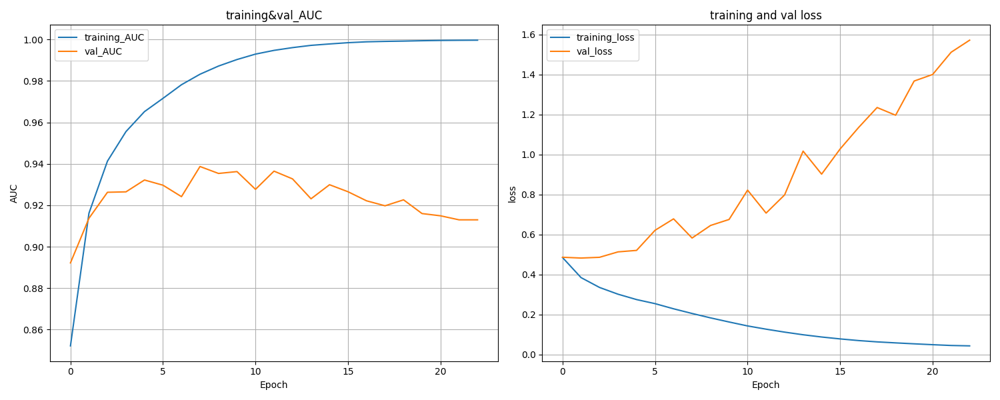

# **语义匹配项目**


## 项目介绍

本项目实现了一个基于深度学习的短文本语义匹配模型，用于判断两个句子在语义上是否相似。模型采用双塔架构，结合了BERT风格的Transformer编码器和传统神经网络技术。


## 数据集说明

训练数据包含输入query- pair，以及对应的真值。初赛训练样本10万，复赛训练样本30万（已使用 *data.ipynb* 进行融合，共计40万条数据）。为确保数量，每一个样本的真值都有进行人工标注校验。每行为一个训练样本，由query- pair和真值组成，每行格式如下：

```markdown
· query- pair格式：query以中文为主，中间可能带有少量英文单词（如英文缩写、品牌词、设备型号等），采用UTF- 8编码，未分词，之间使用ts分割。
# ps：数据集经过脱敏处理，文本query中字或词会转成唯一整数ID，ID与ID之间使用空格分割

· 真值：真值可为0或1，其中1代表query- pair含义相匹配，0则代表不匹配，真值与query- pair之间也用\t分割。
```


数据集下载地址：

[Semantic_Matching (kaggle.com)](https://www.kaggle.com/datasets/rexinshiminxiaozhou/semantic-matching)

或阿里云天池比赛官网：
[【NLP系列学习赛】语音助手：对话短文本语义匹配(aliyun.com)](https://tianchi.aliyun.com/competition/entrance/532329)


## 文件夹目录

```makefile
Semantic_Matching\
├── data.ipynb               # 数据预处理和分析文件
├── data\                    # 原始数据文件夹
    ├── README-data.md       # 数据说明文档
    ├── gaiic_track3_round1_testA_20210228.tsv     # 测试集A
    ├── gaiic_track3_round1_testB_20210317.tsv     # 测试集B
    ├── gaiic_track3_round2_train_20210407.tsv     # 初赛训练集
    ├── gaiic_track3_round1_train_20210228.tsv     # 复赛训练集
    └── train.tsv                                  # 融合后的总体训练集
├── output\                  # 输出文件夹
    ├── log\                 # 日志文件夹
        └── Semantic_Matching.log  # 训练日志
    ├── model\               # 模型文件夹
        ├── semantic_matching_model_best.h5  # 最佳模型文件
    ├── pic\                 # 图片文件夹
    ├── train(kaggle).ipynb  # Kaggle训练的原始 Notebook
    └── validation_predictions.csv  # 验证集预测结果
├── predict.py               # 预测脚本
├── train.py                 # 训练脚本
├── README.md
└── requirements.txt
```


## 模型架构实现

### 1. 编码器架构

采用多层神经网络结构：

1. ***嵌入层***：

  \- 词嵌入(256维) + 位置编码

  \- 使用L2正则化(1e-5)防止过拟合

2. ***双向LSTM层***：

- 128个隐藏单元，返回完整序列

3. ***自注意力机制***：

- 4头注意力，key/value维度64

4. ***卷积层***：

- 256个过滤器，核大小3和5

5. ***池化层***：

- 全局平均池化 + 全局最大池化

6. ***投影层***：

- 512维密集投影 + Dropout(0.3)

### 2. 特征融合

1. 绝对差特征

2. 余弦相似度

3. 拼接原始编码

### 3. 预测头

- 2层MLP (256 → 128)

- 每层后接Dropout(0.3)

- Sigmoid输出层


## 快速开始

1. 安装依赖：

```bash
pip install -r requirements.txt
```

2. 训练模型

```bash
python train.py
```


## 结果展示

评估标准采用效果标准，**AUC** 指标，具体定义如下：
$$
AUC = \frac{\sum\limits_{i \in \text{语义匹配样本集}} \text{rank}(i) - \dfrac{M(1+M)}{2}}{M \times N}
$$
其中：

$rank(i)$：表示这个样本的预测得分在测试集中的排序；
$M$：测试集中语义匹配的样本的个数；
$N$：测试集中语义不匹配的样本的个数。

训练损失记录：



验证集上 AUC 指数变化：


战绩可查 ∠( ᐛ 」∠)_：

